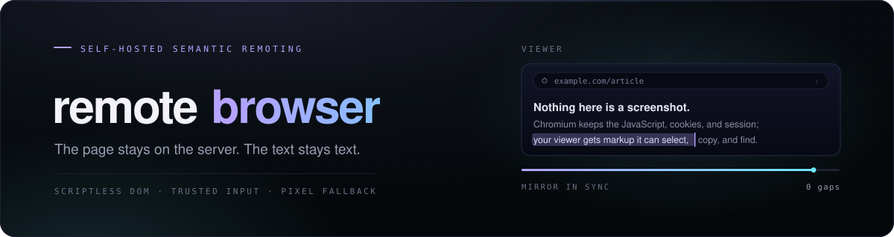

<p align="center">
  
</p>

Remote Browser runs a web page on your server and rebuilds it as a scriptless,
interactive page in your browser.

Text stays sharp, selectable, copyable, and locally findable. Visited-page
JavaScript, cookies, and network sessions stay inside the remote Chromium. When
a page cannot be faithfully rebuilt, media lanes and a whole-tab pixel mode
cover the difficult parts.

[Quick start](#quick-start) ·
[How it works](#how-it-works) ·
[Configuration](docs/configuration.md) ·
[Deployment](docs/deployment.md) ·
[Security](docs/security.md)

> [!IMPORTANT]
> This is an early build for a small set of trusted viewers. Its scriptless DOM
> mirror is a different security boundary from pixel-only remote browsing.
> Read the [security model](docs/security.md) before exposing it beyond
> localhost.

## Quick start

You need Docker Engine and Docker Compose v2 on a modern Linux host.

```sh
git clone https://github.com/mystxcal/remote-browser.git
cd remote-browser
./scripts/bootstrap.sh
```

The bootstrap creates local credentials, builds the two containers, waits for
Chromium, and prints the URL and generated password. It leaves an existing
`.env` untouched.

Open <http://localhost:8080> and browse. The default deployment listens only on
loopback and keeps the Chromium profile ephemeral.

```sh
docker compose ps
curl --fail http://localhost:8080/healthz
```

Stop it with:

```sh
docker compose down
```

## Compared with

Most remote browsing hands you pixels. Remote Browser hands you a rebuilt page,
so text is still text.

| Compared with | Why use Remote Browser | Use the other tool when |
| --- | --- | --- |
| [Kasm Workspaces](https://github.com/kasmtech) and other streamed-container browsers | Text stays selectable, copyable, and findable with your browser's own search, and a page costs a DOM diff rather than a video stream. | You need full desktop applications, or a hardened throwaway container per session. |
| [Apache Guacamole](https://guacamole.apache.org) | Built for the one case of a web page instead of being a general RDP, VNC, and SSH gateway. | You want remote desktops and shells through the same door. |
| Commercial remote browser isolation (Cloudflare, Zscaler) | Self-hosted and inspectable, with the reconstruction rules in this repository. | You need enterprise policy, identity integration, and a support contract. |
| A plain VNC or X session | Much less bandwidth, and the page reflows to your window instead of arriving as a fixed-size screenshot. | You want raw pixels for everything, rather than only where reconstruction gives up. |

## How it works

The page remains authoritative in remote Chromium. An in-page recorder sends a
snapshot and ordered changes to the gateway, which rebuilds them inside a
sandboxed viewer without running the visited page's scripts. Input travels back
to the real page through Chrome DevTools Protocol events.

This is not VNC. Ordinary pages remain semantic, so text and interaction can
stay local and crisp. Canvas, video, WebGL, and divergent pages can fall back
to scoped WebRTC or pixels.

The current build includes:

- **Full interaction.** Tabs, navigation, pointer, keyboard, touch, IME,
  uploads, and downloads.
- **Recovery in order.** A viewer that falls behind resyncs without losing its
  place.
- **Real page structure.** Shadow DOM, cross-origin frames, proxied assets,
  fonts, and CSS.
- **Driver and viewer roles** for a small trusted group.
- **An optional persistent browser profile.**

The default Compose path runs one browsing session. Compatibility still varies
by site, especially around DRM, unusual browser APIs, hostile CSP combinations,
and cross-origin media.

Read [Architecture](docs/architecture.md) for the full data flow and
[Troubleshooting](docs/troubleshooting.md) when a page diverges.

## Deployment

Keep the application port on loopback and put HTTPS in front of it. CDP must
remain private.

Three things to get right:

- **Use stable signing secrets.** Rotating them invalidates every live session.
- **Install an outbound policy.** Chromium must not reach your private
  infrastructure.
- **Leave profile persistence off** unless you intend to retain browser
  credentials.

The exact settings and production boundary live in:

- [Configuration](docs/configuration.md)
- [Deployment](docs/deployment.md)
- [Security model](docs/security.md)

## Development

Use Node 22.23.1 and pnpm 9.15.9.

```sh
corepack enable
pnpm install --frozen-lockfile
CHROME_PATH=/usr/bin/google-chrome pnpm run ci
```

`pnpm run ci` builds the workspace, checks types and formatting, runs the unit
suite, and exercises the browser mirror against real Chromium.

See [Contributing](CONTRIBUTING.md) for the working rules.

## Related

Same idea, different job — one thing done properly, nothing in the middle,
and a result you can check:

- [FrankenFile](https://github.com/mystxcal/frankenfile) — self-hosted file drop; six characters, links expire
- [Chatinabox](https://github.com/mystxcal/chatinabox) — drive the Codex CLI on your server from Telegram

The rest are listed on [my profile](https://github.com/mystxcal).

## License

Apache License 2.0. See [LICENSE](LICENSE), [NOTICE](NOTICE), and
[third-party notices](THIRD_PARTY_NOTICES.md).
